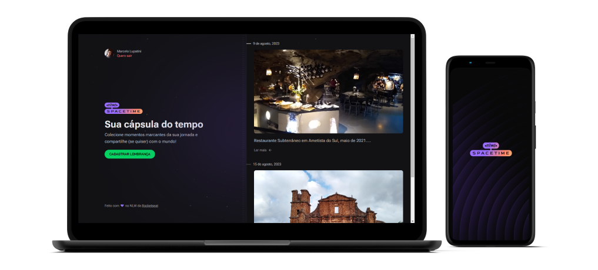
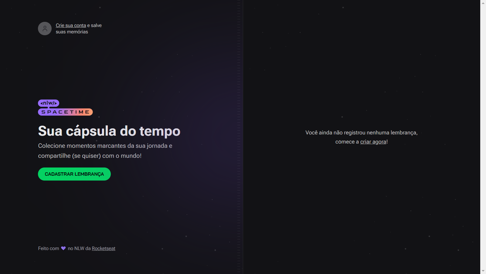
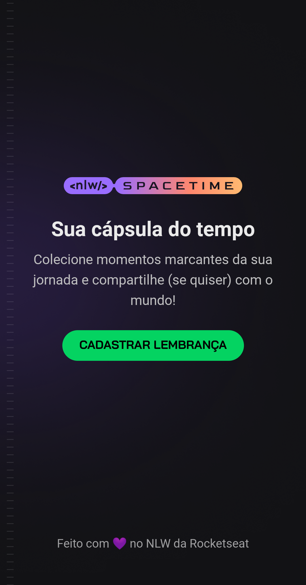
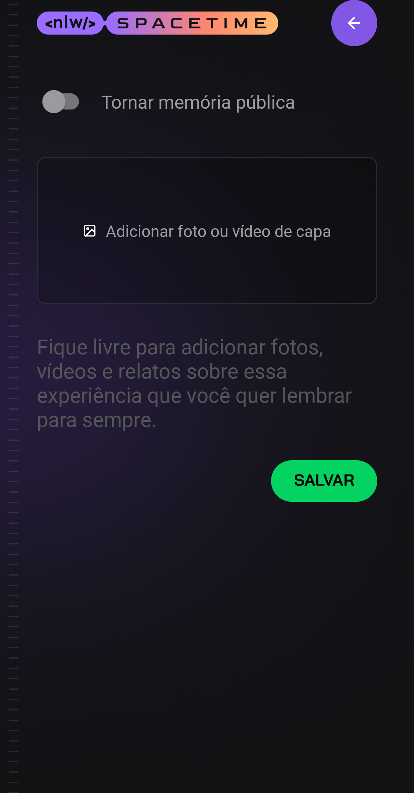

<h1 align="center">
  
</h1>

<h4 align="center"> 
  Next Level Week #12 - Spacetime
</h4>

  
  
  
  
  
  

* [Índice](#índice)
* [Sobre](#sobre)
  * [Conceito do projeto](#conceito-do-projeto)
  * [Tecnologias](#principais-tecnologias-utilizadas)
* [Créditos](#créditos)
* [Licença](#licença)

## Sobre

O projeto foi desenvolvido durante a décima segunda edição do evento Next Level Week proporcionado pela empresa [Rocketseat](https://rocketseat.com.br/). Baseou-se em um layout elaborado no Figma.

O sistema, desenvolvido em TypeScript, é composto de um servidor HTTP Node, um [site](https://spacetime.marcel099.vercel.app/) em React e um aplicativo móvel em React Native.

A opção por essas ferramentas foi realizada pela Rocketseat por acreditarem formar um conjunto de tecnologias poderoso ao permitir desenvolver desde o Back-End até o aplicativo móvel em uma só linguagem: o JavaScript. A escolha por TypeScript, um superset do JavaScript, foi realizada por acreditar trazer um aumento de confiabilidade de código.

### Conceito do projeto

O Spacetime é um sistema para recordação de memórias.

Tanto na versão web quanto na versão mobile, o usuário se cadastra no sistema utilizando login social com GitHub. Após se autenticar, o usuário pode adicionar textos e fotos a uma linha do tempo dedicada a acontecimentos marcantes da sua vida.

  

  
  

### Principais tecnologias utilizadas

O sistema foi desenvolvido em JavaScript. É composto de 3 partes:

- Back-End
  - [Node.js](https://nodejs.org/en/)
  - [Fastify](https://fastify.io/)
  - [Zod](https://zod.dev/)
  - [Prisma](https://www.prisma.io/)
  - [PostgreSQL](https://www.postgresql.org/)
- Front-End Web
  - [Next](https://nextjs.org/)
  - [React](https://react.dev/)
  - [Tailwind CSS](https://tailwindcss.com/)
  - [Lucide](https://lucide.dev/)
  - [JavaScript Cookie](https://www.npmjs.com/package/js-cookie)
  - [Day.js](https://day.js.org/)
- Front-End Mobile
  - [React Native](https://reactnative.dev/)
  - [Expo](https://expo.dev/)
  - [Expo Router](https://docs.expo.dev/routing/introduction/)
  - [Expo Fonts](https://docs.expo.dev/develop/user-interface/fonts/)
  - [Expo Auth Session](https://docs.expo.dev/versions/latest/sdk/auth-session/)
  - [Expo Image Picker](https://docs.expo.dev/versions/latest/sdk/imagepicker/)
  - [Expo Secure Store](https://docs.expo.dev/versions/latest/sdk/securestore/)
  - [NativeWind](https://nativewind.dev/)
  - [Day.js](https://day.js.org/)

Alguns pontos a destacar:

- Cada aplicação possui [ESLint](https://eslint.org/) configurado para padronização de código
- A autenticação do usuário baseia-se em login social com [GitHub OAuth](https://developer.github.com/v3/oauth/) e persistência da sessão com [JWT](https://jwt.io/)
- Validação de dados enviados ao servidor HTTP através da biblioteca [Zod](https://zod.dev/)
- A hospedagem de imagens de avatar de usuário é realizada no [ImgBB](https://pt-br.imgbb.com/)
- Seleção e upload de imagem armazenada no smartphone do usuário através da biblioteca [Expo Image Picker](https://docs.expo.dev/versions/latest/sdk/imagepicker/)

Se desejar explorar as rotas do servidor HTTP Node desenvolvido para esse sistema, poderá fazer isso através do [Insomnia](https://insomnia.rest/).

## Créditos

Credito a elaboração do modelo do banner deste documento e do banner social ao autor desconhecido desta [postagem](https://mckups.com/pixel-4-and-pixelbook-go-mockup/) no site [Mckups](https://mckups.com). Foi adaptado por mim de acordo com as características deste projeto.

## Licença

Este projeto está sob a licença MIT. Para maiores detalhes acesse o <a href="./LICENSE.md">arquivo de licença</a>.
